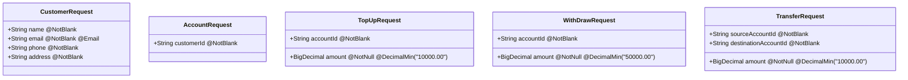

# Dokumentasi Teknis - REST API Perbankan (Mini Banking)

Dokumentasi ini menjelaskan arsitektur, desain database, endpoint REST API, struktur kelas, dan validasi yang diimplementasikan dalam proyek REST API Perbankan sederhana berbasis Spring Boot 3/4, JPA, dan PostgreSQL.

---

## 1. Arsitektur Proyek & Struktur Paket

Aplikasi dirancang mengikuti arsitektur berlapis (layered architecture) standar Java Spring Boot:
* **Controller Layer** (`com.indivaragroup.jdt17.spring.rest.api.controllers`): Menangani HTTP request, melakukan validasi payload (`@Valid`), dan mengembalikan data dalam format terstandarisasi (`WebResponse`).
* **Service Layer** (`com.indivaragroup.jdt17.spring.rest.api.services`): Berisi logika bisnis aplikasi, pengelolaan transaksi perbankan (`@Transactional`), dan pemetaan DTO.
* **Repository Layer** (`com.indivaragroup.jdt17.spring.rest.api.repositories`): Interface Spring Data JPA yang berinteraksi langsung dengan database PostgreSQL.
* **Entity Layer** (`com.indivaragroup.jdt17.spring.rest.api.entity`): Definisi entitas JPA yang memetakan tabel relasional database.
* **Models Layer** (`com.indivaragroup.jdt17.spring.rest.api.models`): Berisi DTO (Data Transfer Objects) untuk Request dan Response.
* **Exception Layer** (`com.indivaragroup.jdt17.spring.rest.api.exception`): Mengatur penanganan error global.

---

## 2. Desain Database & Entitas

Aplikasi menggunakan tiga tabel utama: `mst_customer` (master customer), `mst_account` (master rekening), dan `transaction` (log riwayat transaksi).

### A. Customer (`mst_customer`)
Merepresentasikan data nasabah pemilik rekening.
* **ID Generasi**: UUID String otomatis (`GenerationType.UUID`).

| Field | Tipe Data | Anotasi Database | Deskripsi |
| :--- | :--- | :--- | :--- |
| `customerId` | `String` | `@Id`, `customer_id` | Primary Key (UUID) |
| `name` | `String` | `name` | Nama lengkap nasabah |
| `email` | `String` | `email` | Alamat email unik |
| `phone` | `String` | `phone` | Nomor telepon aktif |
| `address` | `String` | `address` | Alamat kota tinggal |

### B. Account (`mst_account`)
Merepresentasikan rekening perbankan milik nasabah.
* **ID Generasi**: Otomatis UUID String (`GenerationType.UUID`).
* **Nomor Rekening**: Dihasilkan secara acak dengan awalan `100` diikuti 8-digit nomor acak unik.

| Field | Tipe Data | Anotasi Database | Deskripsi |
| :--- | :--- | :--- | :--- |
| `accountId` | `String` | `@Id`, `account_id` | Primary Key (UUID) |
| `accountNumber` | `String` | `account_number`, `unique` | Nomor rekening unik |
| `balance` | `BigDecimal` | `balance` | Saldo rekening |
| `customer` | `Customer` | `@ManyToOne`, `customer_id` | Relasi ke nasabah |

### C. Transaction (`transaction`)
Menyimpan riwayat mutasi debit dan kredit rekening.

| Field | Tipe Data | Anotasi Database | Deskripsi |
| :--- | :--- | :--- | :--- |
| `transactionId` | `String` | `@Id`, `transaction_id` | Primary Key (UUID) |
| `transactionType` | `TransactionType` | `transaction_type` | Enum: `TOP_UP`, `WITHDRAW`, `TRANSFER_SENDER`, `TRANSFER_RECEIVER` |
| `amount` | `BigDecimal` | `amount` | Nominal transaksi |
| `transactionDate` | `LocalDateTime` | `transaction_date` | Waktu terjadinya transaksi |
| `sourceAccountId` | `String` | `source_account_id` | ID Rekening asal (jika transfer/tarik) |
| `destinationAccountId`| `String` | `destination_account_id` | ID Rekening tujuan (jika transfer/topup) |
| `balanceBefore` | `BigDecimal` | `balance_before` | Saldo rekening sebelum transaksi |
| `balanceAfter` | `BigDecimal` | `balance_after` | Saldo rekening setelah transaksi |

---

## 3. Dokumentasi Endpoint API

Semua response API dibungkus dalam format seragam menggunakan `WebResponse<T>`:
```json
{
  "code": 200,
  "status": "OK",
  "data": { ... }
}
```

### A. Customer Endpoints (`/api/customers`)

#### 1. Register Customer
* **Method**: `POST`
* **Path**: `/api/customers/register`
* **Request Body** (`CustomerRequest`):
  ```json
  {
    "name": "Budi Santoso",
    "email": "budi@email.com",
    "phone": "081234567890",
    "address": "Jakarta"
  }
  ```
* **Response Status**: `201 Created`

#### 2. Get All Customers (Paginated)
* **Method**: `GET`
* **Path**: `/api/customers`
* **Query Parameters**:
  * `page` (default: 0): Indeks halaman.
  * `size` (default: 10): Jumlah item per halaman.
* **Response Status**: `200 OK`

#### 3. Get Customer by ID
* **Method**: `GET`
* **Path**: `/api/customers/{id}`
* **Response Status**: `200 OK` (atau `404 Not Found` jika ID tidak ada).

#### 4. Update Customer
* **Method**: `PUT`
* **Path**: `/api/customers/{id}`
* **Request Body** (`CustomerRequest`):
  ```json
  {
    "name": "Budi Santoso Edit",
    "email": "budiedit@email.com",
    "phone": "081234567890",
    "address": "Bandung"
  }
  ```
* **Response Status**: `200 OK`

#### 5. Delete Customer
* **Method**: `DELETE`
* **Path**: `/api/customers/{id}`
* **Response Status**: `200 OK`

---

### B. Account Endpoints (`/api/accounts`)

#### 1. Create Account
* **Method**: `POST`
* **Path**: `/api/accounts/register`
* **Request Body** (`AccountRequest`):
  ```json
  {
    "customerId": "8ff7f2a7-ad29-45ad-bb52-520e5cd04ca3"
  }
  ```
* **Response Status**: `201 Created`

#### 2. Get All Accounts (Paginated)
* **Method**: `GET`
* **Path**: `/api/accounts`
* **Query Parameters**:
  * `page` (default: 0)
  * `size` (default: 10)
* **Response Status**: `200 OK`

#### 3. Get Account by ID
* **Method**: `GET`
* **Path**: `/api/accounts/{id}`
* **Response Status**: `200 OK`

#### 4. Get Account by Account Number
* **Method**: `GET`
* **Path**: `/api/accounts/account-number/{accountNumber}`
* **Response Status**: `200 OK`

---

### C. Transaction Endpoints (`/api/transactions`)

#### 1. Top Up Saldo
* **Method**: `POST`
* **Path**: `/api/transactions/topup`
* **Request Body** (`TopUpRequest`):
  ```json
  {
    "accountId": "account-uuid-here",
    "amount": 50000.00
  }
  ```
* **Response Status**: `200 OK`
* **Rules**: Minimal top up Rp10.000,00.

#### 2. Tarik Tunai (Withdraw)
* **Method**: `POST`
* **Path**: `/api/transactions/withdraw`
* **Request Body** (`WithDrawRequest`):
  ```json
  {
    "accountId": "account-uuid-here",
    "amount": 100000.00
  }
  ```
* **Response Status**: `200 OK`
* **Rules**: Minimal penarikan Rp50.000,00. Saldo harus mencukupi.

#### 3. Transfer Antar Rekening
* **Method**: `POST`
* **Path**: `/api/transactions/transfer`
* **Request Body** (`TransferRequest`):
  ```json
  {
    "sourceAccountId": "source-account-uuid",
    "destinationAccountId": "destination-account-uuid",
    "amount": 25000.00
  }
  ```
* **Response Status**: `200 OK`
* **Rules**: Minimal transfer Rp10.000,00. Biaya admin didefinisikan di config (`bank.transfer.admin-fee` = Rp2.500,00). Saldo pengirim didebet sebesar nominal + biaya admin.
* **Catatan**: Transaksi ini otomatis mencatat dua record transaksi di database: `TRANSFER_SENDER` (debet pada pengirim) dan `TRANSFER_RECEIVER` (kredit pada penerima).

#### 4. Get All Transactions (Paginated & Sorted)
* **Method**: `GET`
* **Path**: `/api/transactions`
* **Query Parameters**:
  * `page` (default: 0)
  * `size` (default: 10)
* **Response Status**: `200 OK` (Hasil diurutkan berdasarkan tanggal terbaru/descending).

#### 5. Get Transaction by ID
* **Method**: `GET`
* **Path**: `/api/transactions/{id}`
* **Response Status**: `200 OK`

#### 6. Get Account Transactions with Type Filtering (Paginated & Sorted)
* **Method**: `GET`
* **Path**: `/api/transactions/account/{accountId}`
* **Query Parameters**:
  * `type` (default: `ALL`): Jenis filter. Pilihan: `ALL`, `TOPUP`, `TRANSFER_IN` (memetakan ke `TRANSFER_RECEIVER`), `TRANSFER_OUT` (memetakan ke `TRANSFER_SENDER`), atau `WITHDRAW`.
  * `page` (default: 0)
  * `size` (default: 10)
* **Response Status**: `200 OK` (Diurutkan berdasarkan tanggal terbaru/descending).

---

## 4. Spesifikasi Kelas dan Method Utama

### A. Controllers
1. **`CustomerController`**:
   - `@PostMapping("/register")`: `addCustomer(@Valid @RequestBody CustomerRequest)` -> Mendaftarkan customer baru.
   - `@GetMapping`: `getAllCustomers(@RequestParam int page, @RequestParam int size)` -> Mengembalikan list customer terpaginasi.
   - `@GetMapping("/{id}")`: `getCustomer(@PathVariable String id)` -> Menampilkan customer by ID.
   - `@PutMapping("/{id}")`: `update(@PathVariable String id, @Valid @RequestBody CustomerRequest)` -> Memperbarui data customer.
   - `@DeleteMapping("/{id}")`: `delete(@PathVariable String id)` -> Menghapus customer.
2. **`AccountController`**:
   - `@PostMapping("/register")`: `createAccount(@Valid @RequestBody AccountRequest)` -> Membuka rekening baru untuk nasabah.
   - `@GetMapping`: `getAllAccounts(@RequestParam int page, @RequestParam int size)` -> Menampilkan semua rekening terpaginasi.
   - `@GetMapping("/{id}")`: `getAccountById(@PathVariable String id)` -> Mengambil data rekening berdasarkan ID.
   - `@GetMapping("/account-number/{accountNumber}")`: `getAccountByAccountNumber(@PathVariable String accountNumber)` -> Mengambil data rekening berdasarkan nomor rekening.
3. **`TransactionController`**:
   - `@PostMapping("/topup")`: `topUp(@Valid @RequestBody TopUpRequest)` -> Melakukan pengisian saldo.
   - `@PostMapping("/withdraw")`: `withdraw(@Valid @RequestBody WithDrawRequest)` -> Melakukan penarikan tunai.
   - `@PostMapping("/transfer")`: `transfer(@Valid @RequestBody TransferRequest)` -> Mengirim uang antar rekening.
   - `@GetMapping`: `getAllTransactions(@RequestParam int page, @RequestParam int size)` -> Menampilkan seluruh log transaksi.
   - `@GetMapping("/{id}")`: `getTransactionById(@PathVariable String id)` -> Menampilkan log transaksi berdasarkan ID transaksi.
   - `@GetMapping("/account/{accountId}")`: `getTransactionsByAccount(...)` -> Menampilkan log transaksi per rekening yang dapat difilter berdasarkan jenis transaksi (`ALL`, `TOPUP`, `TRANSFER_IN`, `TRANSFER_OUT`, `WITHDRAW`).

### B. Services
1. **`CustomerService`**:
   - `@Transactional addCustomer(CustomerRequest)`: Menyimpan data customer. UUID digenerate otomatis oleh Hibernate.
   - `@Transactional(readOnly = true) getCustomerById(String)`: Menemukan customer atau melempar `ResponseStatusException(404, "Customer tidak ditemukan")`.
2. **`AccountService`**:
   - `@Transactional createAccount(AccountRequest)`: Memverifikasi apakah customer ada, men-generate nomor rekening acak berformat `"100" + 8_digit_random`, lalu menyimpannya.
   - `@Transactional(readOnly = true) getAccountByAccountNumber(String)`: Mencari akun berdasarkan nomor rekening atau melempar `ResponseStatusException(404, "Account not found")`.
3. **`TransactionService`**:
   - `@Transactional topUp(TopUpRequest)`: Menambah saldo rekening dan menyimpan satu record `TOP_UP`.
   - `@Transactional withdraw(WithDrawRequest)`: Memvalidasi kecukupan saldo, mengurangi saldo rekening, dan menyimpan satu record `WITHDRAW`.
   - `@Transactional transfer(TransferRequest)`: Memvalidasi rekening tujuan, memeriksa kecukupan saldo pengirim terhadap jumlah transfer + biaya admin. Melakukan debet dan kredit saldo, serta menyimpan dua record transaksi (`TRANSFER_SENDER` dan `TRANSFER_RECEIVER`).

### C. Exception Handling (`GlobalExceptionHandler`)
Pemberian respon error ditangani secara global agar struktur JSON seragam meskipun error berasal dari framework/validation.
* `@ExceptionHandler(ResponseStatusException.class)`: Mengembalikan response dengan HTTP Status yang sesuai dan menyertakan pesan error bisnis dari service.
* `@ExceptionHandler(MethodArgumentNotValidException.class)`: Menangkap kegagalan validasi payload (misal nominal kurang dari syarat minimum atau kolom kosong), menggabungkan seluruh pesan error, dan mengembalikan HTTP Status `400 Bad Request`.
* `@ExceptionHandler(Exception.class)`: Menangkap error server internal lainnya agar sistem tidak melempar stacktrace mentah ke client, melainkan response JSON `500 Internal Server Error`.

---

## 5. Validasi Payload & Data Integrity

Berikut ringkasan aturan validasi pada request payload:



* **Pencegahan Nilai Negatif / Kosong**: Penggunaan anotasi `@NotNull` dan `@DecimalMin` menjamin bahwa nominal transaksi di bawah batas minimum langsung ditolak di layer controller tanpa membebani logic database.
* **Perlindungan Double Transfer**: Method `transfer` di layer service memvalidasi agar pengirim tidak dapat melakukan transfer ke nomor rekeningnya sendiri (`sourceAccountId.equals(destinationAccountId)`).
